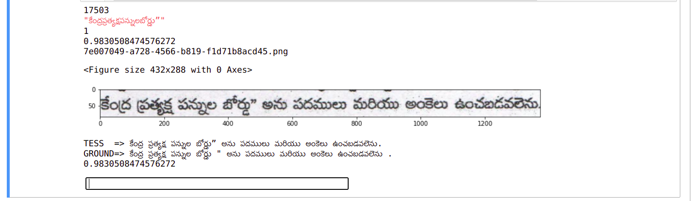

# ANUVAAD OCR Training using Tesseract

Training workflow for Tesseract 4

### Data Pre processing
The training Data is prepared with using Anuvaad 
```
OCR Workflow - Generating JSON or/and TXT from a pdf document containing  digitization information at line/word level with ANUVAAD WORKFLOW.
               
```
https://github.com/project-anuvaad/ocr-toolkit/tree/ocr_toolkit/ocr
 ```
OCR_BENCHMARK - It generates CSV from input JSON, and then run tesseract on the pdf’s csv generated with custom or default weights to  generate lines and saves in report csv.
                This report_csv contains initial ground truth generated from OCR and the tesseract predictions, thus it is benchmarking of the tesseract weights.
                
```
https://github.com/project-anuvaad/ocr-toolkit/tree/ocr_toolkit/ocr_benchmark
```
Error profiling - (Jupyter notebook) Error profiling on the generated csv from ocr_benchmark contains line crops and GroundTruths of OCR and Tesseract predictions, segrigate these with score based on class wise
                              '''
                                Class -2 : Manual intervention required 
                                class -1 : tesseract correct
                                class 0 : charater mismatch ಕೆ as ಕ
                                Class 1 : ೧೧ . as NAN, ೧೧ . as 1, 2 as 2.0, 1.40 as 1.0, 14 as 1, etc.  ( digit error)
                                Class 2 : ಚಿಹ್ನೆಗಳು as ಚಿಹೆಗಳು,  ಬಾಗಲಕೋಟ as ಬದಾಗಲಕೋಟ, ಎಲ್ಎಕೂ as ಎಲ್‌ಎಕ್ಯೂ etc.  (Auxiliaries)
                                Class 3 : / as |, " as ' ', etc        (Special characters)
                                Class 4 : கிடங்கு as யபI, கடனாக as -IபI, etc. (contradiction)
                                Class 5 : ಅರ್ಜೆಂಟಿನಾ as             (Missing text and crop issue)
                                Class 6 : Text repeatation

                              ''' 
                              and manually check for error in line crops groundTruth and  rectify the text line and add class to based on if the texts has any error.
                              eg:
```
https://github.com/project-anuvaad/ocr-toolkit/blob/ocr_toolkit/error-profiling/error_profiling.ipynb
```
```


```                            
SYNTHETIC DATA GENERATOR - Provided a txt document containing line texts, lines from error profiling, 
                           fonts and background images, It generates line crop and ground text .gt.txt files as tesseract training required extensions.
```
https://github.com/project-anuvaad/ocr-toolkit/tree/ocr_toolkit/synthetic_data_generator


### Python
You need a recent version of Python 3.x. For image processing the Python library Pillow is used. If you don't have a global installation, please use the provided requirements file pip install -r requirements.txt.
```sh
  bash start.sh
```
use start.sh script to clone to tesseract train repo


## Choose model name

Choose a name for your model. By convention, Tesseract stack models including
language-specific resources use (lowercase) three-letter codes defined in
[ISO 639](https://en.wikipedia.org/wiki/List_of_ISO_639-1_codes) with additional
information separated by underscore. E.g., `chi_tra_vert` for **tra**ditional
Chinese with **vert**ical typesetting. Language-independent (i.e. script-specific)
models use the capitalized name of the script type as identifier. E.g.,
`Hangul_vert` for Hangul script with vertical typesetting. In the following,
the model name is referenced by `MODEL_NAME`.

## Provide ground truth

Place ground truth consisting of line images and transcriptions in the folder
`data/MODEL_NAME-ground-truth`. This list of files will be split into training and
evaluation data, the ratio is defined by the `RATIO_TRAIN` variable.

Images must be TIFF and have the extension `.tif` or PNG and have the
extension `.png`, `.bin.png` or `.nrm.png`.

Transcriptions must be single-line plain text and have the same name as the
line image but with the image extension replaced by `.gt.txt`.

The repository contains a ZIP archive with sample ground truth, see
[ocrd-testset.zip](./ocrd-testset.zip). Extract it to `./data/foo-ground-truth` and run
`make training`.

## Train

```
 make training MODEL_NAME=name-of-the-resulting-model
 ```
 ```
 eg:
    make training MODEL_NAME=tel_v1 START_MODEL=Devanagari PSM=7 TESSDATA=/usr/share/tesseract-ocr/4.00/tessdata MAX_ITERATIONS=200000
```

which is basically a shortcut for

```
   make unicharset lists proto-model training
```

Run `make help` to see all the possible targets and variables:

<!-- BEGIN-EVAL -w '```' '```' -- make help -->
```

  Targets

    unicharset       Create unicharset
    lists            Create lists of lstmf filenames for training and eval
    training         Start training
    traineddata      Create best and fast .traineddata files from each .checkpoint file
    proto-model      Build the proto model
    leptonica        Build leptonica
    tesseract        Build tesseract
    tesseract-langs  Download tesseract-langs
    clean            Clean all generated files

  Variables

    MODEL_NAME         Name of the model to be built. Default: foo
    START_MODEL        Name of the model to continue from. Default: ''
    PROTO_MODEL        Name of the proto model. Default: 'data/foo/foo.traineddata'
    CORES              No of cores to use for compiling leptonica/tesseract. Default: 4
    LEPTONICA_VERSION  Leptonica version. Default: 1.78.0
    TESSERACT_VERSION  Tesseract commit. Default: 4.1.1
    TESSDATA_REPO      Tesseract model repo to use. Default: _best
    TESSDATA           Path to the .traineddata directory to start finetuning from. Default: ./usr/share/tessdata
    GROUND_TRUTH_DIR   Ground truth directory. Default: data/MODEL_NAME-ground-truth
    OUTPUT_DIR         Output directory for generated files. Default: data/MODEL_NAME
    MAX_ITERATIONS     Max iterations. Default: 10000
    EPOCHS             Set max iterations based on the number of lines for training. Default: none
    LEARNING_RATE      Learning rate. Default: 0.0001 with START_MODEL, otherwise 0.002
    NET_SPEC           Network specification. Default: [1,36,0,1 Ct3,3,16 Mp3,3 Lfys48 Lfx96 Lrx96 Lfx256 O1c\#\#\#]
    FINETUNE_TYPE      Finetune Training Type - Impact, Plus, Layer or blank. Default: ''
    LANG_TYPE          Language Type - Indic, RTL or blank. Default: ''
    PSM                Page segmentation mode. Default: 6
    RANDOM_SEED        Random seed for shuffling of the training data. Default: 0
    RATIO_TRAIN        Ratio of train / eval training data. Default: 0.90
    TARGET_ERROR_RATE  Stop training if the character error rate (CER in percent) gets below this value. Default: 0.01
```

<!-- END-EVAL -->


### Make model files (traineddata)

When the training is finished, it will write a `traineddata` file which can be used
for text recognition with Tesseract. Note that this file does not include a
dictionary. The `tesseract` executable therefore prints an warning.

It is also possible to create additional `traineddata` files from intermediate
training results (the so called checkpoints). This can even be done while the
training is still running. Example:

    # Add MODEL_NAME and OUTPUT_DIR like for the training.
    make traineddata

This will create two directories `tessdata_best` and `tessdata_fast` in `OUTPUT_DIR`
with a best (double based) and fast (int based) model for each checkpoint.

It is also possible to create models for selected checkpoints only. Examples:

    # Make traineddata for the checkpoint files of the last three weeks.
    make traineddata CHECKPOINT_FILES="$(find data/foo -name '*.checkpoint' -mtime -21)"

    # Make traineddata for the last two checkpoint files.
    make traineddata CHECKPOINT_FILES="$(ls -t data/foo/checkpoints/*.checkpoint | head -2)"

    # Make traineddata for all checkpoint files with CER better than 1 %.
    make traineddata CHECKPOINT_FILES="$(ls data/foo/checkpoints/*[^1-9]0.*.checkpoint)"

Add `MODEL_NAME` and `OUTPUT_DIR` and replace `data/foo` by the output directory if needed.

## Plotting CER (experimental)

Training and Evaluation CER can be plotted using matplotlib. A couple of scripts are provided
as a starting point in `plot` subdirectory for plotting of different training scenarios. The training
log is expected to be saved in `plot/TESSTRAIN.LOG`.

As an example, use the training data provided in 
[ocrd-testset.zip](./ocrd-testset.zip) to do training and generate the plots.
Plotting can be done while training is running also to depict the training status till then.
```
unzip ocrd-testset.zip -d data/ocrd-ground-truth
nohup make training MODEL_NAME=ocrd START_MODEL=frk TESSDATA=~/tessdata_best MAX_ITERATIONS=10000 > plot/TESSTRAIN.LOG &
```
```
cd ./plot
./plot_cer.sh 
```
## License

Software is provided under the terms of the `Apache 2.0` license.

Sample training data provided by [Deutsches Textarchiv](https://deutschestextarchiv.de) is [in the public domain](http://creativecommons.org/publicdomain/mark/1.0/).
